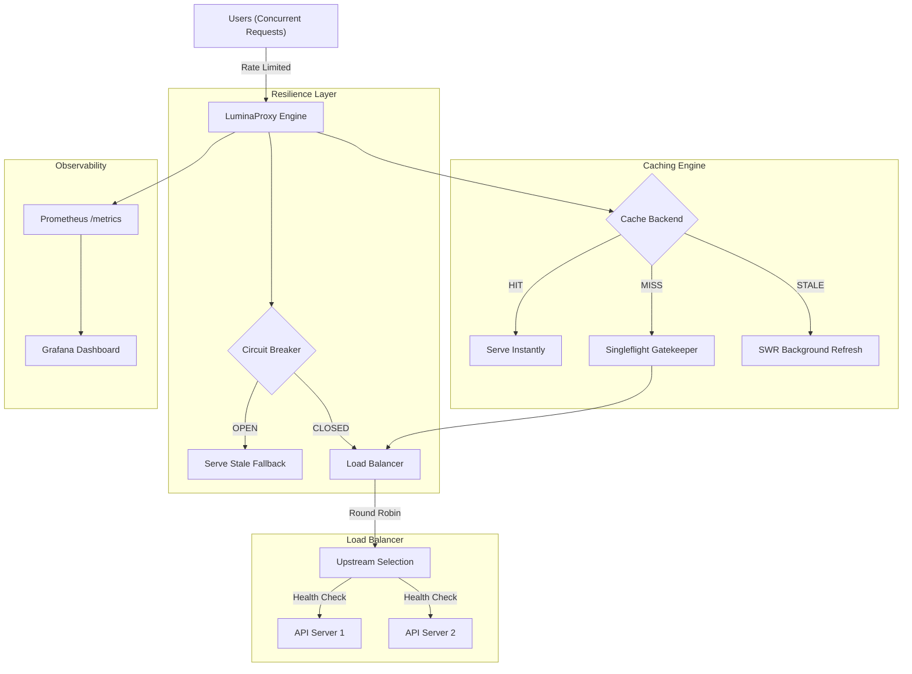

# 🚀 Go-Lumina Enterprise API Gateway

**Go-Lumina** is a production-ready, high-performance API Gateway and Distributed Caching Proxy written in Golang. It is designed to handle high-traffic environments by providing multi-level resilience, observability, and extreme efficiency.

## ✨ Enterprise Features

- **⚖️ Round-Robin Load Balancing**: Automatically distributes traffic across multiple upstream servers with built-in **Active Health Checks**.
- **🧠 Hybrid Caching (Distributed)**: Seamlessly switch between local **LRU Memory Cache** and **Redis Distributed Cache** for multi-instance scalability.
- **🛡️ Circuit Breaker (Netflix Hystrix Style)**: Protects your infrastructure by "tripping" the circuit during upstream failures, preventing cascading outages.
- **⚡ Stale-While-Revalidate (SWR)**: Delivers instant responses (0ms latency) using stale data while refreshing the cache in the background.
- **🛡️ Anti-Cache Stampede (Singleflight)**: Ensures only ONE request reaches the upstream for a specific resource, even under massive concurrent load.
- **📈 Deep Observability**: Native **Prometheus** metrics integration and pre-configured **Grafana** dashboards.
- **bouncer IP-Based Rate Limiting**: Protects against DDoS and abusive clients using a Token Bucket algorithm.
- **🐳 DevOps Ready**: Ultra-slim Docker images (< 10MB) and full `docker-compose` orchestration.

---

## 🏗️ Architecture



---

## 🛠️ Tech Stack

- **Core**: Go 1.26+, `net/http/httputil`
- **Caching**: `github.com/hashicorp/golang-lru/v2`, `github.com/redis/go-redis/v9`
- **Resilience**: Custom Circuit Breaker implementation, `golang.org/x/sync/singleflight`
- **Observability**: `github.com/prometheus/client_golang`
- **Infrastructure**: Docker, Redis, Prometheus, Grafana

---

## 🚀 Quick Start (Docker Compose)

The easiest way to see Go-Lumina in action is using `docker-compose`. This will spin up the Proxy, Redis, Prometheus, and Grafana.

```bash
# Clone and Run
git clone https://github.com/AmiQT/LuminaProxy.git
cd LuminaProxy
docker-compose up --build
```

### Access Points:
- **Proxy Gateway**: `http://localhost:8080`
- **Prometheus**: `http://localhost:9090`
- **Grafana**: `http://localhost:3000` (Default: `admin/admin`)
- **JSON Metrics**: `http://localhost:8080/lumina-metrics`

---

## ⚙️ Configuration (Environment Variables)

| Variable | Description | Default |
| :--- | :--- | :--- |
| `LUMINA_UPSTREAMS` | Comma-separated upstream URLs | `http://localhost:8081` |
| `LUMINA_PORT` | Port the proxy listens on | `8080` |
| `LUMINA_REDIS_URL` | Redis connection string (enables distributed cache) | `""` (Uses LRU) |
| `LUMINA_CACHE_TTL_SECONDS` | Time to live for cache items | `300` |

---

## 📊 Observability & Metrics

Go-Lumina exposes high-granularity metrics for SREs:
- `lumina_requests_total`: Total requests processed.
- `lumina_cache_hits_total`: Total successful cache hits.
- `lumina_cache_misses_total`: Total cache misses.
- `lumina_circuit_trips_total`: Number of times the circuit breaker has tripped.

---

## ⚖️ License
MIT License. Created by **AmiQT**.
