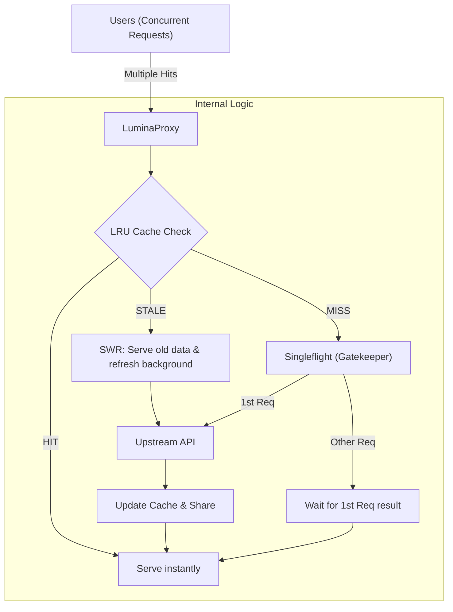

# Project Context: Go-Lumina Proxy

## Project Overview
**Go-Lumina** is a high-performance, enterprise-grade, in-memory caching reverse proxy written entirely in Golang. Its primary function is to sit in front of an upstream API server to drastically reduce latency, prevent upstream overload (cache stampedes), and save external bandwidth using advanced concurrent caching mechanisms.

## Tech Stack & Dependencies
*   **Language:** Go (1.26+)
*   **Standard Library:** net/http, net/http/httputil, sync, sync/atomic, os/signal
*   **LRU Cache:** github.com/hashicorp/golang-lru/v2
*   **Concurrency Sync:** golang.org/x/sync/singleflight
*   **Rate Limiting:** golang.org/x/time/rate
*   **Deployment:** Docker (Multi-stage), Docker Compose (Scratch-based, < 5MB image)

## Core Architecture & Enterprise Features

### Architecture Overview

### 1. In-Memory LRU Caching
*   Caches only HTTP GET requests.
*   Utilizes a thread-safe LRU (Least Recently Used) mapping structure capped at 2,000 items to prevent Out-Of-Memory (OOM) crashes.
*   Uses sync.RWMutex to ensure race-condition-free reads and writes.

### 2. Singleflight (Anti-Cache Stampede)
*   Integrates golang.org/x/sync/singleflight.
*   If a cache MISS occurs and 10,000 users request the same endpoint simultaneously, LuminaProxy holds the subsequent requests, sends exactly ONE request to the upstream, and shares the single response with all waiting clients. 

### 3. Stale-While-Revalidate (SWR) Mechanism
*   Implements a two-tier expiration system.
*   If a request hits a "Stale" cache, the proxy instantly serves the stale data to the user (0 latency) while spawning a background Goroutine to fetch fresh data from the upstream.

### 4. IP-Based Rate Limiting (Bouncer)
*   Utilizes a Token Bucket algorithm.
*   Limits each unique IP address to 500 requests/second with a burst capacity of 1,000. Over-limit requests are immediately dropped with a 429 Too Many Requests status.

### 5. Graceful Shutdown
*   Listens for SIGINT/SIGTERM context signals to securely terminate the process.

### 6. Security & Observability
*   **Security:** Bypasses caching entirely if the upstream response contains a Set-Cookie header.
*   **Observability:** Exposes a JSON endpoint at /lumina-metrics displaying metrics.

## Performance Benchmarks (Localhost / Windows Environment)
*   **Throughput:** Sustained ~5,000 to ~7,500 Requests Per Second (RPS).
*   **Stress Test:** Successfully processed 1,000,000 requests in ~3 minutes using a custom worker-pool load tester.
*   **Bandwidth Efficiency:** Handled 5,000 concurrent requests to a 1.5MB JSON endpoint, saving ~7.5GB of theoretical external bandwidth by fetching the 1.5MB exactly once.

## Deployment (Dockerized)
*   Built using Docker Multi-stage configuration.
*   Compiled with CGO_ENABLED=0 GOOS=linux and compressed with UPX into a scratch-based container (< 5MB).

